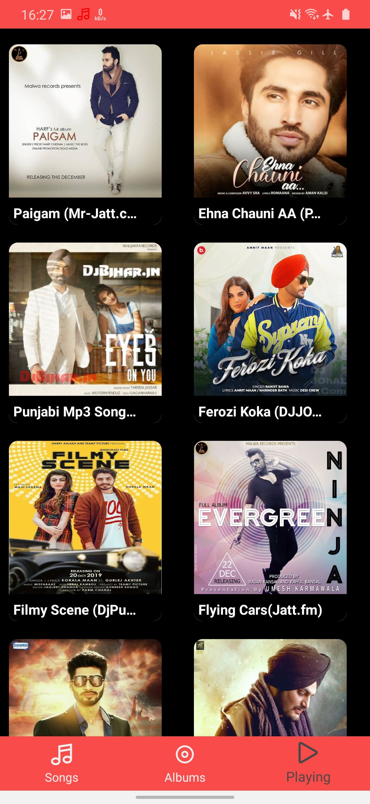
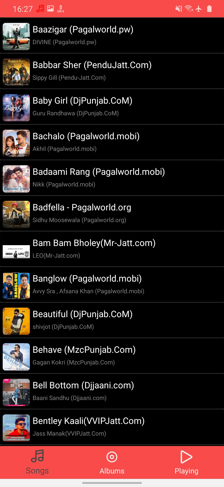

# Alphabet Music App

The Alphabet Music App is a simple music player application for Android devices that allows users to play and manage their music collection. It provides features like listing all songs, displaying songs based on albums.

## Screenshots

<table>
  <tr>
    <td></td>
    <td></td>
    <td></td>
    <td></td>
  </tr>
</table>

## Features

- List all songs available on the device
- View songs based on albums
- Play, pause, and skip songs
- Display album art and song details.

## Installation

1. Clone the repository to your local machine.
2. Open the project in Android Studio.
3. Build and run the app on your Android device or emulator.

## Libraries Used

- Glide: For loading and caching album art images
- RecyclerView: For displaying lists of songs and albums
- MediaMetadataRetriever: For extracting metadata (e.g., album art) from media files
- Palette: For extracting color information from album art

