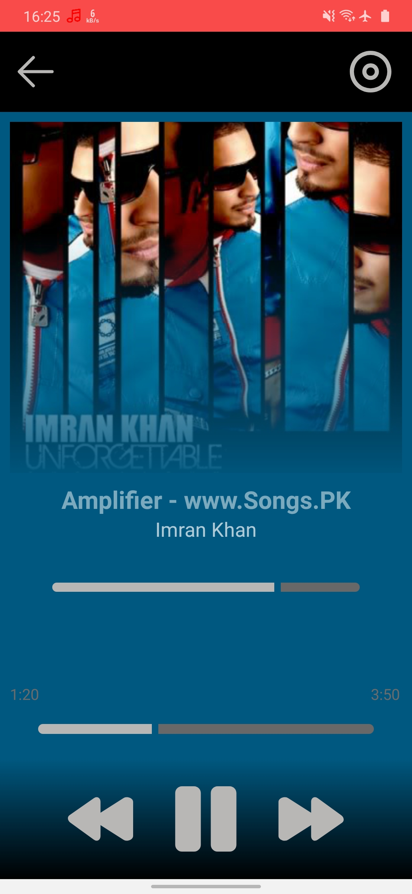

# Alphabet Music App

The Alphabet Music App is a versatile music player application for Android devices, offering users the ability to manage and enjoy their music collection. In addition to the core features like listing all local songs, viewing songs based on albums, and playing, pausing, and skipping tracks, the app now includes the ability to fetch and play songs from a custom API.

## Screenshots

<table>
  <tr>
    <td></td>
    <td></td>
    <td></td>
    <td></td>
  </tr>
</table>

## Features

- **List and Play Songs:** View and play all songs available on the device.
- **Album View:** Organize and explore songs based on albums.
- **API Integration:** Fetch songs from a custom API and play them seamlessly.
- **Play Controls:** Play, pause, and skip songs with ease.
- **Album Art and Details:** Display album art and song details for a rich listening experience.

## Installation

1. Clone the repository to your local machine.
2. Open the project in Android Studio.
3. Build and run the app on your Android device or emulator.

## Libraries Used

- **Glide:** For efficient loading and caching of album art images.
- **RecyclerView:** For displaying lists of songs and albums.
- **MediaMetadataRetriever:** For extracting metadata (e.g., album art) from media files.
- **Palette:** For extracting color information from album art.
- **Retrofit:** For making API calls and handling responses seamlessly.

## Download

Download the APK file [here](https://drive.google.com/file/d/1dxlk-kP6_oPUFdnqb_ZJbzpEBRCu3bg_/view?usp=sharing).

